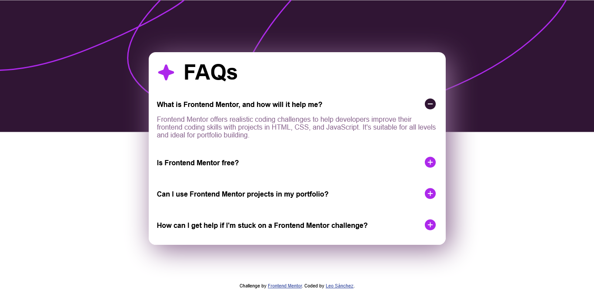
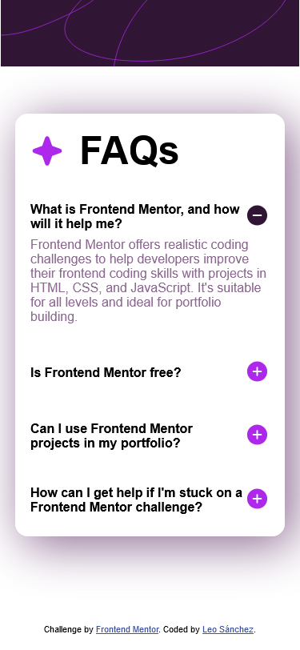

# Frontend Mentor - FAQ accordion solution

This is a solution to
the [FAQ accordion challenge on Frontend Mentor](https://www.frontendmentor.io/challenges/faq-accordion-wyfFdeBwBz).
Frontend Mentor challenges help you improve your coding skills by building realistic projects.

## Table of contents

- [Overview](#overview)
    - [The challenge](#the-challenge)
    - [Screenshot](#screenshot)
    - [Links](#links)
- [My process](#my-process)
    - [Built with](#built-with)
    - [What I learned](#what-i-learned)
- [Author](#author)
- [Acknowledgments](#acknowledgments)

## Overview

### The challenge

Users should be able to:

- Hide/Show the answer to a question when the question is clicked
- Navigate the questions and hide/show answers using keyboard navigation alone
- View the optimal layout for the interface depending on their device's screen size
- See hover and focus states for all interactive elements on the page

### Screenshot



###### Desktop version



###### Mobile version

### Links

- Solution URL: [Faq Accordion](https://github.com/L-ux-es/Faq-Accordion-Main)
- Live Site URL: [Frontend Mentor | Faq Accordion](https://l-ux-es.github.io/Faq-Accordion-Main/)

## My process

### Built with

- Semantic HTML5 markup
- CSS custom properties
- Flexbox
- JavaScript

### What I learned

```css
.hidden {
    display: none;
}
```

```js
function expand(id) {
    const indexAnswerToChange = String(id).at(1) - 1;
    for (let i = 0; i < answers.length; i++) {
        if (i !== indexAnswerToChange && !answers.item(i).classList.contains(classToChange)) {
            answers.item(i).classList.add(classToChange);
            images.item(i).setAttribute("src", imagenPlus);
        }
    }
    const answerToChange = answers.item(indexAnswerToChange);
    const imagenToChange = images.item(indexAnswerToChange);
    if (answerToChange.classList.contains(classToChange)) {
        imagenToChange.setAttribute("src", imagenMinus);
    } else {
        imagenToChange.setAttribute("src", imagenPlus);
    }
    answerToChange.classList.toggle(classToChange);
}
```

## Author

- GitHub - [L-ux-es](https://github.com/L-ux-es)
- Frontend Mentor - [@L-ux-es](https://www.frontendmentor.io/profile/L-ux-es)